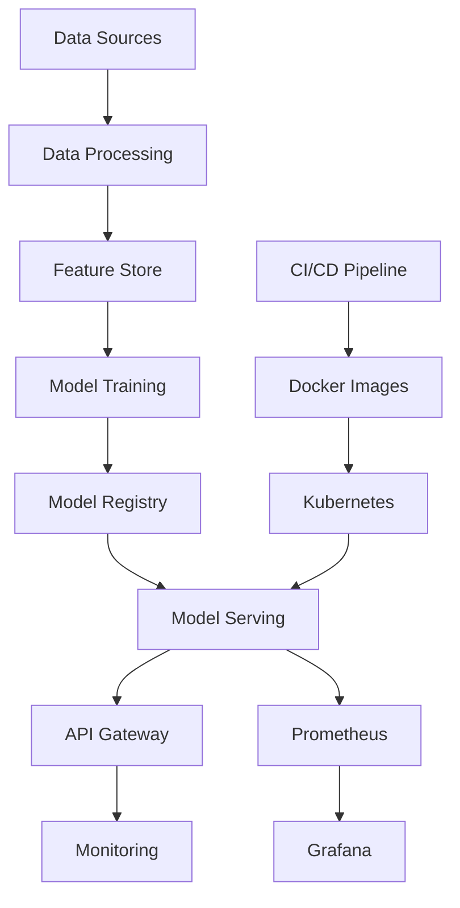

# Fraud Detection MLOps 🚀

[](https://opensource.org/licenses/MIT)
[](https://www.python.org/downloads/)
[](https://hub.docker.com/)
[](https://kubernetes.io/)

A comprehensive MLOps solution for fraud detection using machine learning, FastAPI, and Kubernetes deployment. This project demonstrates end-to-end machine learning operations including data processing, model training, serving, monitoring, and deployment.

## 📋 Table of Contents

- [Features](#-features)
- [Architecture](#-architecture)
- [Quick Start](#-quick-start)
- [Project Structure](#-project-structure)
- [Installation](#-installation)
- [Usage](#-usage)
- [Deployment](#-deployment)
- [API Documentation](#-api-documentation)
- [Monitoring](#-monitoring)
- [Development](#-development)
- [Contributing](#-contributing)
- [License](#-license)

## 🌟 Features

### Machine Learning
- **Multiple Algorithms**: Random Forest, Logistic Regression, Isolation Forest
- **Feature Engineering**: Automated feature processing and transformation
- **Model Evaluation**: Comprehensive metrics and validation
- **Hyperparameter Tuning**: Configurable model parameters

### MLOps & DevOps
- **Containerization**: Docker containers for consistent deployment
- **Orchestration**: Kubernetes manifests and Helm charts
- **CI/CD**: GitHub Actions pipeline with automated testing
- **API Service**: FastAPI-based REST API for predictions
- **Monitoring**: Prometheus metrics and Grafana dashboards
- **Logging**: Structured logging with configurable levels

### Data Processing
- **ETL Pipeline**: Automated data ingestion and processing
- **Data Validation**: Schema validation and quality checks
- **Feature Store**: Organized feature management
- **Sample Data Generation**: Built-in data generation for testing

## 🏗 Architecture



### Technology Stack
- **Backend**: Python 3.9+, FastAPI, uvicorn
- **ML Libraries**: scikit-learn, pandas, numpy
- **Containerization**: Docker, Docker Compose
- **Orchestration**: Kubernetes, Helm
- **Monitoring**: Prometheus, Grafana
- **CI/CD**: GitHub Actions
- **Data Storage**: File-based (extensible to databases)

## 🚀 Quick Start

### Prerequisites
- Python 3.9+
- Docker and Docker Compose
- Make (optional, for convenience commands)

### 1. Clone and Setup
```bash
git clone https://github.com/gholakioko/fraud-detection-mlops.git
cd fraud-detection-mlops

# Create virtual environment
python -m venv venv
source venv/bin/activate  # On Windows: venv\\Scripts\\activate

# Install dependencies
pip install -r requirements.txt
```

### 2. Generate Sample Data and Train Model
```bash
# Using Make (recommended)
make sample-data
make train

# Or manually
python -c "from src.utils.helpers import generate_sample_data; df = generate_sample_data(5000, 0.1); df.to_csv('data/raw/sample_fraud_data.csv', index=False)"
python src/training/train_model.py --data-path data/raw/sample_fraud_data.csv --model-type random_forest
```

### 3. Start the API
```bash
# Using Make
make serve

# Or manually
cd src && python -m uvicorn serving.app:app --host 0.0.0.0 --port 8000 --reload
```

### 4. Test the API
```bash
# Health check
curl http://localhost:8000/health

# Make a prediction
curl -X POST http://localhost:8000/predict \
  -H "Content-Type: application/json" \
  -d '{"amount": 1500.0, "merchant_category": "online", "hour": 14, "customer_age": 35}'
```

Visit `http://localhost:8000/docs` for interactive API documentation.

## 📁 Project Structure

```
fraud-detection-mlops/
├── data/                          # Data storage
│   ├── raw/                      # Raw input data
│   ├── processed/                # Processed data
│   └── external/                 # External data sources
├── notebooks/                     # Jupyter notebooks for analysis
├── src/                          # Source code
│   ├── data/                     # Data processing modules
│   ├── models/                   # ML model implementations
│   ├── training/                 # Training pipelines
│   ├── serving/                  # API serving code
│   └── utils/                    # Utility functions
├── models/                       # Trained models storage
│   ├── trained/                  # Production models
│   └── artifacts/                # Model artifacts
├── infra/                        # Infrastructure as Code
│   ├── k8s/                      # Kubernetes manifests
│   ├── docker/                   # Docker configurations
│   └── ci-cd/                    # CI/CD pipelines
├── charts/                       # Helm charts
│   └── fraud-detection/          # Main service chart
├── requirements.txt              # Python dependencies
├── docker-compose.yml            # Local development setup
├── Makefile                      # Automation commands
└── README.md                     # This file
```

## 💻 Installation

### Development Setup
```bash
# Clone repository
git clone https://github.com/gholakioko/fraud-detection-mlops.git
cd fraud-detection-mlops

# Setup virtual environment
make setup
source venv/bin/activate

# Install dependencies with development tools
make install-dev

# Generate sample data
make sample-data
```

### Docker Setup
```bash
# Build Docker image
make docker-build

# Run with Docker Compose (includes monitoring)
make docker-compose-up

# Access services:
# - API: http://localhost:8000
# - Grafana: http://localhost:3000 (admin/admin)
# - Prometheus: http://localhost:9090
```

## 🔧 Usage

### Training Models
```bash
# Train default Random Forest model
make train

# Train specific model type
python src/training/train_model.py \
  --data-path data/raw/your_data.csv \
  --model-type logistic_regression \
  --output-dir models/trained

# Train all model types
make train-all
```

### API Usage

#### Health Check
```bash
GET /health
```

#### Single Prediction
```bash
POST /predict
Content-Type: application/json

{
  "amount": 1500.0,
  "merchant_category": "online",
  "hour": 14,
  "day_of_week": 1,
  "is_weekend": 0,
  "customer_age": 35,
  "transaction_type": "purchase"
}
```

#### Batch Predictions
```bash
POST /predict/batch
Content-Type: application/json

{
  "transactions": [
    {
      "amount": 1500.0,
      "merchant_category": "online",
      "hour": 14,
      "customer_age": 35
    },
    {
      "amount": 50.0,
      "merchant_category": "grocery",
      "hour": 10,
      "customer_age": 42
    }
  ]
}
```

#### Model Information
```bash
GET /model/info
```

## 🚀 Deployment

### Kubernetes Deployment

#### Prerequisites
- Kubernetes cluster (local or cloud)
- kubectl configured
- Helm 3.x (optional)

#### Using kubectl
```bash
# Create namespace and deploy
make k8s-deploy

# Check deployment status
make k8s-status

# Delete deployment
make k8s-delete
```

#### Using Helm
```bash
# Install with Helm
make helm-install

# Upgrade deployment
make helm-upgrade

# Uninstall
make helm-uninstall
```

### Cloud Deployment

#### AWS EKS
```bash
# Configure kubectl for EKS
aws eks update-kubeconfig --region us-west-2 --name your-cluster-name

# Deploy using kubectl or Helm
make k8s-deploy
```

#### Google GKE
```bash
# Configure kubectl for GKE
gcloud container clusters get-credentials your-cluster-name --zone us-central1-a

# Deploy
make k8s-deploy
```

#### Azure AKS
```bash
# Configure kubectl for AKS
az aks get-credentials --resource-group your-rg --name your-cluster-name

# Deploy
make k8s-deploy
```

## 📖 API Documentation

The API provides comprehensive OpenAPI/Swagger documentation:

- **Interactive Docs**: http://localhost:8000/docs
- **ReDoc**: http://localhost:8000/redoc
- **OpenAPI JSON**: http://localhost:8000/openapi.json

### Key Endpoints

| Endpoint | Method | Description |
|----------|--------|-----------|
| `/` | GET | Service health check |
| `/health` | GET | Detailed health status |
| `/predict` | POST | Single fraud prediction |
| `/predict/batch` | POST | Batch fraud predictions |
| `/model/info` | GET | Model information and metadata |

### Response Formats

All responses include:
- **is_fraud**: Binary prediction (0/1)
- **fraud_probability**: Confidence score (0-1)
- **confidence**: Text confidence level (low/medium/high)

## 📊 Monitoring

### Prometheus Metrics
The service exposes metrics at `/metrics`:
- Request count and latency
- Prediction statistics
- Model performance metrics
- System resource usage

### Grafana Dashboards
Access Grafana at http://localhost:3000 (admin/admin):
- API Performance Dashboard
- Model Metrics Dashboard
- Infrastructure Monitoring

### Logging
Structured JSON logging with configurable levels:
```bash
# Set log level via environment
export LOG_LEVEL=DEBUG
```

## 🛠 Development

### Code Quality
```bash
# Format code
make format

# Lint code
make lint

# Run tests
make test

# Run all quality checks
make check
```

### Testing
```bash
# Run unit tests
pytest tests/

# Run with coverage
make test

# Test API endpoints
make test-api
```

### Pre-commit Hooks
```bash
# Install pre-commit hooks
make install-dev

# Run hooks manually
pre-commit run --all-files
```

### Notebooks
Jupyter notebooks for exploration and analysis:
```bash
# Start Jupyter server
jupyter lab

# Or with Docker
docker-compose up jupyter
```

## 🔄 CI/CD Pipeline

The GitHub Actions pipeline includes:
1. **Code Quality**: Linting, formatting, type checking
2. **Testing**: Unit tests with coverage reporting
3. **Security**: Vulnerability scanning with Trivy
4. **Building**: Docker image creation and pushing
5. **Deployment**: Automated deployment to staging/production

### Required Secrets
- `KUBE_CONFIG`: Kubernetes config for staging
- `PROD_KUBE_CONFIG`: Kubernetes config for production
- `SLACK_WEBHOOK`: Slack notifications (optional)

## 🤝 Contributing

1. Fork the repository
2. Create a feature branch: `git checkout -b feature/amazing-feature`
3. Make your changes and add tests
4. Run quality checks: `make check test`
5. Commit changes: `git commit -m 'Add amazing feature'`
6. Push to branch: `git push origin feature/amazing-feature`
7. Open a Pull Request

### Development Guidelines
- Follow PEP 8 style guide
- Write comprehensive tests
- Update documentation
- Use type hints
- Add docstrings for functions and classes

## 📝 License

This project is licensed under the MIT License - see the [LICENSE](LICENSE) file for details.

## 🙏 Acknowledgments

- [scikit-learn](https://scikit-learn.org/) for machine learning algorithms
- [FastAPI](https://fastapi.tiangolo.com/) for the web framework
- [Docker](https://www.docker.com/) for containerization
- [Kubernetes](https://kubernetes.io/) for orchestration
- [Prometheus](https://prometheus.io/) and [Grafana](https://grafana.com/) for monitoring

## 📞 Support

- 📧 Email: ghollahkioko@gmail.com
- 🐛 Issues: [GitHub Issues](https://github.com/gholakioko/fraud-detection-mlops/issues)
- 📖 Docs: [Project Documentation](https://github.com/gholakioko/fraud-detection-mlops/wiki)

---

**Made with ❤️ for the ML community**

# fraud-detection-mlops
fraud detection end to end mlops project
